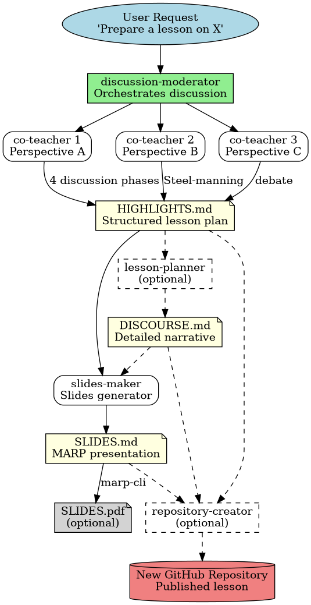

# AI Lesson Planner

[](LICENSE)

Chat-first toolkit for planning complete courses and generating lesson artifacts with specialized Copilot agents.

## Web app (Netlify)

A browser-based version lives in `site/`. It runs entirely client-side (localStorage) and exports `.lesson-config.json`, lesson README files, and full course ZIP archives.

### Deploy on Netlify

1. Connect this repository at [app.netlify.com](https://app.netlify.com)
2. Build settings (auto-detected from `netlify.toml`):
   - **Publish directory:** `site`
   - **Build command:** none required
3. Deploy — no environment variables needed

### Local preview

```bash
npm install
npm run dev
```

Open `http://localhost:8888`.

## Recommended start (chat-first)

Use `@course-planner` as the first step to design the whole course, then run lesson-level agents.

```text
@course-planner Plan a course on Python programming for upper-secondary students, 12 lessons, 90 minutes each.
```

What `@course-planner` prepares:
- course outline in `lessons/README.md`
- course metadata in `.lesson-config.json`
- lesson scaffolding checklist with `./scripts/generate-lesson.sh`
- optional full-course scaffolding with `./scripts/generate-course-scaffolding.sh`
- handoff prompts for lesson-level agents

## Agent flow

1. `@course-planner` → design course structure (outline only)
2. `@discussion-moderator` → generate lesson highlights
3. `@lesson-planner` (optional) → expand highlights into discourse
4. `@slides-maker` → generate MARP slide files
5. `./scripts/generate-slides-pdf.sh` → export final PDF

## Quick start

### 1) Plan the course in chat

```text
@course-planner Create a 10-lesson course on AI agents. Include prerequisites and progression by module.
```

### 2a) Scaffold lesson folders

Run generated commands (example):

```bash
./scripts/generate-lesson.sh 01 intro-ai-agents "Introduction to AI Agents"
./scripts/generate-lesson.sh 02 prompting-basics "Prompting Basics"
```

Or scaffold the whole course directly from `.lesson-config.json`:

```bash
./scripts/generate-course-scaffolding.sh
```

### 2b) Generate lesson content in chat

```text
@discussion-moderator Prepare lesson #01: Introduction to AI Agents
@lesson-planner Create discourse for lesson #01
@slides-maker Create slides for lesson #01
```

### 3) Export PDF (per single lesson)

```bash
./scripts/generate-slides-pdf.sh lessons/lesson-01-intro-ai-agents
```

## Agents

- `course-planner`: course outline, metadata, scaffolding plan (no lesson content)
- `discussion-moderator`: structured lesson highlights via moderated debate
- `lesson-planner`: detailed discourse from highlights
- `slides-maker`: MARP slide generation
- `co-teacher`: perspective agent used by moderator flow
- `repository-creator` (optional): publishing support

## How does it work



## Language behavior

- Default language is English.
- If the user explicitly requests another language, agents should follow that request.
- For course-level planning, language can be derived from `.lesson-config.json` metadata when available.

## Scripts

See full scripts documentation in [scripts/README.md](scripts/README.md).

## License

This project is licensed under the GNU General Public License v3.0 (or later).
See [LICENSE](LICENSE) for full terms.
